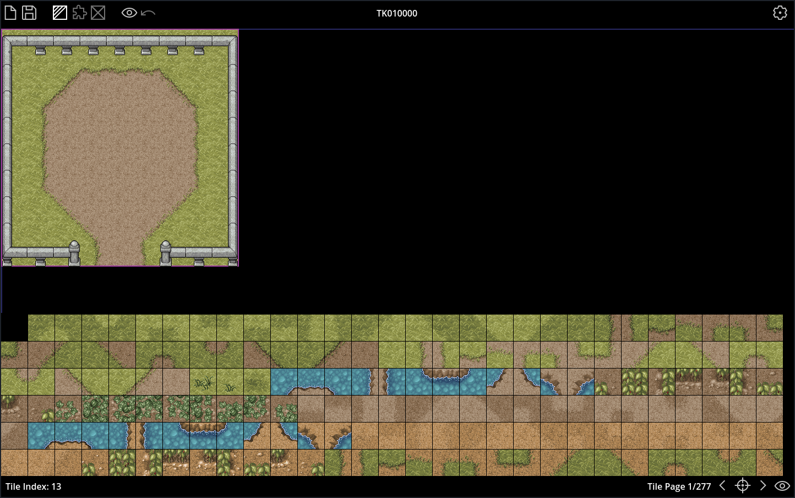

# TKMapper

NexusTK Map Creator/Editor written in [Godot](https://godotengine.org/) 4.x

## Setup

* Install NexusTK

* **Import** the `project.godot` file into Godot

* **Run** TKMapper, or in the Godot Editor, run the main scene: `TKMapper.tscn` (F5)

## Usage

* Insert or Delete:
    * ` i|1 `: Insert Mode: This allows you to insert tiles/objects
    * ` d|e|x|2 `: Delete Mode: This allows you to delete tiles/objects

* The 3 modes types are:
    * ` t|3 `: Tile Mode: Edits the ground tiles
    * ` o|4 `: Object Mode: Edits the objects
    * ` p|5 `: Unpassable Mode: Edits the unpassable tiles

### Keyboard Shortcuts

* ` l `: Load Map: Opens Load Map Dialog
* ` s `: Save Map: Opens Save Map Dialog
* ` t|3 `: Tile Mode: Toggles Tile Mode
* ` o|4 `: Object Mode: Toggles Object Mode
* ` p|5 `: Unpassable Mode: Toggles Unpassable Mode
* ` m `: Toggle Modes: Toggles between Modes: Tile -> Object -> Unpassable
* ` h|6 `: Hide Objects: Toggles Objects (for ground visibility)
* `` u|` ``: Undo: Undoes The Previous Change
* ` i|1 `: Insert Mode: Enters Insert Mode for Tiles/Objects
* ` d|e|x|2 `: Delete Mode: Enters Delete Mode for Tiles/Objects
* ` g `: Goto Page: Loads Tile/Object Page from Prompt
* ` LEFT `: Loads Previous Tile/Object Selection Page
* ` RIGHT `: Loads Next Tile/Object Selection Page
* ` UP `: Shows Tile/Object Selection Page
* ` DOWN `: Hides Tile/Object Selection Page
* ` SHIFT + UP `: Shifts Map Up (NOT Undoable)
* ` SHIFT + RIGHT `: Shifts Map Right (NOT Undoable)
* ` SHIFT + DOWN `: Shifts Map Down (NOT Undoable)
* ` SHIFT + LEFT `: Shifts Map Left (NOT Undoable)

### Mouse Shortcuts

* ` Scroll Wheel `: Zoom Map
* ` CTRL + Left Mouse Button `: Drag/move map

#### Mode Specific Mouse Shortcuts

* Insert Mode (Over Map):
    * ` Left Mouse Button `: Inserts/places the currently selected tile or object
    (hovering near mouse)
    * ` Right Mouse Button `: Copies the tile or object under the mouse cursor as
    the currently selected tile or object

* Insert Mode (Over Tile/Object Selection):
    * ` Left Mouse Button `: Copies the tile or object under the mouse cursor as the
    currently selected tile or object

* Delete Mode (Over Map):
    * ` Left Mouse Button `: Deletes the tile or object under the mouse cursor
